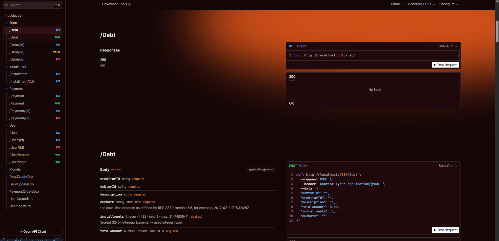

## 📊 DebtTrack

### 📖 Descrição

O Debt Track é um sistema completo para gerenciamento de dívidas entre múltiplas pessoas, projetado para simplificar o controle de empréstimos. Ele permite criar, listar, parcelar e registrar pagamentos de dívidas de forma prática e eficiente. Desenvolvido em .NET, o sistema utiliza DynamoDB como banco de dados e se integra à AWS Lambda e API Gateway para oferecer uma solução escalável e de alta disponibilidade.
### 🚀 Tecnologias Utilizadas


- [.NET](https://dotnet.microsoft.com/pt-br/)
- [ASP.NET](https://learn.microsoft.com/pt-br/aspnet/core/?view=aspnetcore-9.0&WT.mc_id=dotnet-35129-website)
- [JWT](https://jwt.io/)
- [DynamoDb](https://www.postgresql.org/)
- [Aws Lambda](https://aws.amazon.com/pt/dynamodb/)
- [Api Gateway](https://aws.amazon.com/pt/api-gateway/)


## Documentação

Api Documentada com scalar acesse  http://localhost:5010/scalar



## 🔧 **DevOps e Deploy**

- [Git](https://git-scm.com)
- [Docker](https://www.docker.com/)


##  🚀 Como Rodar o Projeto

Para rodar o projeto em seu ambiente local, siga os passos abaixo:

1. ####  Clonar o Repositório
    Primeiramente, clone o repositório do GitHub para sua máquina local:

        $ git clone https://github.com/Faelkk/NewsLetter

2.  ####  Instalar as Dependências
    Acesse o diretório do projeto e instale as dependências:

        $ dotnet restore

3. #### Configure as variaveis de ambiente

```` Logging

 "DynamoDB": {
    "ServiceURL": "http://dynamodb-local:8000"
  },

# JWT
"Jwt": {
    "Key": "MinhaChaveSuperSecreta1234567890",
    "Issuer": "MeuSistema",
    "Audience": "MeusUsuarios",
    "ExpireMinutes": 10080
  },


 "AWS": {
    "AccessKeyId": "fakeMyKeyId",
    "SecretAccessKey": "fakeSecretAccessKey"
  }
 ````

4. #### Configurar o Docker Compose
     Antes de rodar o projeto, configure as variáveis do docker-compose de acordo com as suas necessidades. Certifique-se de que o Docker e o Docker Compose estão instalados corretamente em sua máquina.

5. ### Construir o Projeto com Docker
    Crie as imagens do Docker para o projeto:

        $ docker compose build

6. ####  Subir o Projeto
    Finalmente, suba o projeto utilizando Docker Compose:

        $ docker compose up -d

<br>


### 🤝 **Como Contribuir?**

- ⭐ Deixe uma estrela no repositório.
- 🔗 Me siga aqui no GitHub.
- 👥 Conecte-se comigo no LinkedIn e faça parte da minha rede profissional.

### 👨‍💻**Autor**
Desenvolvido por [Rafael Achtenberg](linkedin.com/in/rafael-achtenberg-7a4b12284/).
